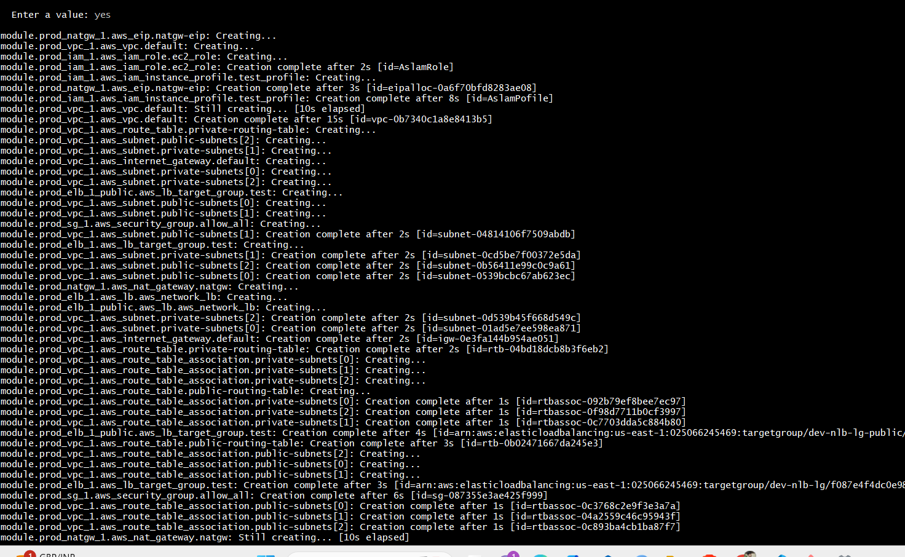

# "Scalable and modular infrastructure setup for cloud environments using Terraform."


This repository demonstrates how to modularize Terraform code for a scalable, manageable infrastructure deployment across multiple environments (e.g., dev, production). The key idea is to break down the Terraform code into modules for various infrastructure components like networking, compute, security groups, load balancers, and NAT gateways. This modular approach minimizes manual changes and overhead when switching between environments.

## Problem Overview

In typical infrastructure deployments, environments like dev, QA, and production might have different requirements (e.g., dev doesn’t need a load balancer or Route53). Managing these differences with a single Terraform codebase can lead to manual changes, which is inefficient. By breaking the code into modules, you can dynamically include/exclude components based on environment requirements, making the infrastructure easier to manage.


## Modular Structure:


############################################################################################################

## Solution

We break the infrastructure into the following modules:
- **Network**: VPC, subnets, routing
- **Compute**: EC2 instances (public and private)
- **Security Groups (SG)**: For securing VPC resources
- **NAT**: NAT gateway for private instance internet access
- **ELB**: Elastic Load Balancers (optional)
- **IAM**: Identity and Access Management

### Folder Structure

```
/modules
  ├── network
  ├── compute
  ├── sg
  ├── nat
  ├── elb
  ├── iam
/development
  ├── main.tf
  ├── variables.tf
  ├── terraform.tfvars
  └── ec2.tf
/production
  ├── infrastructure.tf
  ├── variables.tf
  ├── terraform.tfvars
```

## Step-by-Step Setup

### 1. Create Network Module

1. **Files in `/modules/network`:**
   - `vpc.tf`: Defines the VPC and internet gateway.
   - `public_subnets.tf`: Public subnets configuration.
   - `private_subnets.tf`: Private subnets configuration.
   - `routing.tf`: Routing tables for public and private subnets.
   - `variables.tf`: Define necessary input variables.
   - `outputs.tf`: Export important values (e.g., VPC ID, subnet IDs).
   - `locals.tf`: Set local values for environment or naming conventions.

2. **Import Network Module in Development:**
   - In `/development/infra.tf`, import the network module:
     ```hcl
     module "dev_vpc_1" {
       source = "../modules/network"
       # Specify the necessary variables
       vpc_cidr = var.vpc_cidr
       ...
     }
     ```

3. **Deploy the Network Module:**
   ```bash
   cd development
   terraform init
   terraform fmt
   terraform validate
   terraform apply
   ```

### 2. Configure for Production

- **Copy Files**: Copy the infrastructure setup from `development` to `production`.
  - Ensure variable values are updated (e.g., CIDR blocks should not overlap between environments).

- **Customize Values**: Modify `terraform.tfvars` and `variables.tf` in the `production` folder to match production settings (e.g., CIDR range, environment = "production").

```bash
cd production
terraform init
terraform fmt
terraform apply
```

### 3. Add Security Groups Module

1. **Create `/modules/sg`:**
   - `sg.tf`: Security group configurations.
   - `variables.tf`: Define necessary input variables.
   - `outputs.tf`: Export security group IDs.

2. **Import in Development:**
   - Add the security group module to `development`'s `infra.tf`:
     ```hcl
     module "dev_sg_1" {
       source = "../modules/sg"
       vpc_id = module.dev_vpc_1.vpc_id
       ...
     }
     ```

3. **Deploy SG Module:**
   ```bash
   cd development
   terraform get
   terraform apply
   ```

4. **Replicate for Production**: Similarly, copy the security group module to `production`, making necessary adjustments.

### 4. EC2 (Compute) Module

1. **Create `/modules/compute`:**
   - `private_ec2.tf`: For private EC2 instances.
   - `public_ec2.tf`: For public EC2 instances.
   - `variables.tf`: Define EC2-related variables.
   - `outputs.tf`: Export EC2 instance IDs or other resources.

2. **Deploy in Development**: Add EC2 configuration in `development/ec2.tf`, referencing the module:
   ```hcl
   module "dev_compute_1" {
     source = "../modules/compute"
     vpc_id = module.dev_vpc_1.vpc_id
     ...
   }
   ```

3. **Replicate for Production**: Follow the same process for production, customizing as needed.

### 5. NAT Gateway Module

1. **Create `/modules/nat`:**
   - `natgw.tf`: Defines the NAT gateway.
   - `variables.tf`: Input variables like subnet ID.
   - `outputs.tf`: Export NAT gateway ID.

2. **Deploy NAT in Development and Production**:
   - Ensure the NAT module is added in both environments, with appropriate changes in `terraform.tfvars`.

### Final Steps

- **Destroy**: To clean up, run the following in both environments:
  ```bash
  cd production
  terraform destroy -auto-approve
  cd development
  terraform destroy -auto-approve
  ```

## Key Terraform Commands

- **Format and Validate**:
  ```bash
  terraform fmt
  terraform validate
  ```
- **Initialize**:
  ```bash
  terraform init
  ```
- **Apply Changes**:
  ```bash
  terraform apply
  ```
- **Check State**:
  ```bash
  terraform state list
  ```


# Lets Test each of the environment one by one:


# Development:

```bash
cd /development
 terraform init
 terraform plan
 terraform apply
 terraform state list
 terraform destroy
```


  # Ec2-instances:


###########################################################################


 # Load Balancers:

 


###########################################################################


# Network Infra created:


###########################################################################


# Resources Destroyed:


################################################################################################################


# Production Env:


```bash
cd /production
 terraform init
 terraform plan
 terraform apply
 terraform state list
 terraform destroy
```


# resources created:





############################################################################################


# Load Balancers:


############################################################################################


# Ec2 Instances:


#################################################################################################


# Network Infra Created:


########################################################################################################


# Resources Destroyed:


########################################################################################################


## Notes on Output Values

The `output.tf` files in each module play a crucial role in passing data between modules. For example, the VPC module exports the `vpc_id`, which is consumed by the Security Group module and EC2 module. This modular approach helps ensure that all components are properly linked, and their dependencies are clear.

## Conclusion

This repository demonstrates how to efficiently manage and deploy infrastructure across multiple environments using Terraform modules. By breaking infrastructure code into reusable modules, we reduce complexity, manual work, and potential errors, leading to a more scalable and maintainable solution.


